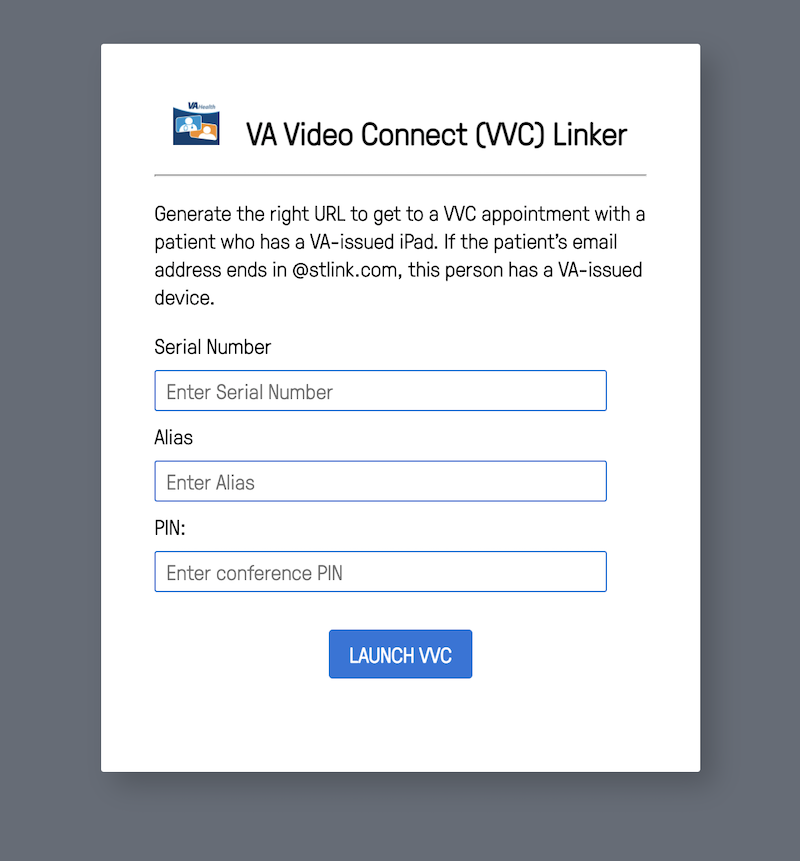

# VVC Linker

Generate the right URL to get to a VVC appointment with a patient who has a VA-issued iPad. If the patient's email address ends in `@stlink.com`, this person has a VA-issued device.

## How to Use

Download the index.html file which can be opened locally without a web server. Or the file can be served remotely on a web server. 

### About

This web app was created by George Marzloff, MD based on a Microsoft Excel tool provided by VA Telehealth. 